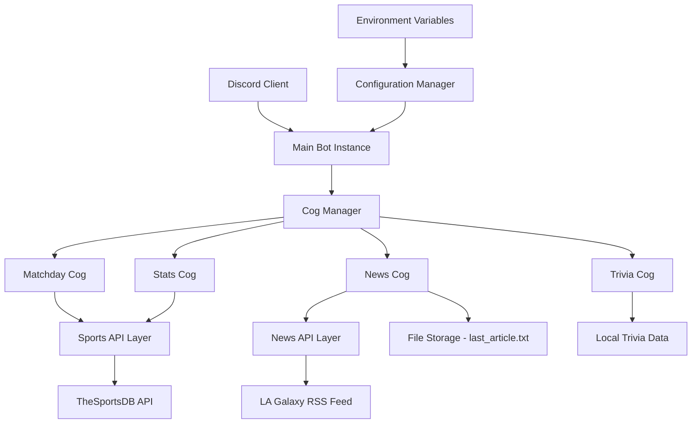

# Design Document

## Overview

Cozmo is a Discord bot built using Python and the discord.py library, designed to serve LA Galaxy fans with comprehensive team information and interactive features. The architecture follows a modular design pattern using Discord.py Cogs for feature separation and a dedicated API layer for external data integration. The bot integrates with TheSportsDB API for sports data and LA Galaxy's RSS feed for news updates.

## Architecture

### High-Level Architecture



### Core Design Principles

1. **Modularity**: Each feature is implemented as a separate Cog for independent development and maintenance
2. **Separation of Concerns**: API logic is separated from Discord interaction logic
3. **Configuration Management**: Centralized configuration using environment variables
4. **Error Handling**: Graceful degradation when external services are unavailable
5. **State Management**: Minimal state storage for trivia games and news tracking

## Components and Interfaces

### Main Bot Component (`main.py`)

**Purpose**: Entry point and bot lifecycle management

**Key Responsibilities**:

- Bot initialization with proper intents
- Automatic Cog loading from the cogs directory
- Event handling setup
- Startup message display

**Interface**:

```python
class CozmoBot(commands.Bot):
    async def setup_hook(self) -> None
    async def on_ready(self) -> None
```

### Configuration Manager (`config.py`)

**Purpose**: Centralized configuration management

**Key Responsibilities**:

- Environment variable loading using python-dotenv
- Configuration validation
- Secure token management

**Interface**:

```python
DISCORD_TOKEN: str
SPORTS_API_KEY: str
NEWS_CHANNEL_ID: int
```

### API Layer

#### Sports API (`api/sports_api.py`)

**Purpose**: Interface with TheSportsDB API for sports data

**Key Responsibilities**:

- Next match retrieval and formatting
- MLS standings data processing
- Player statistics lookup and formatting
- API error handling and rate limiting

**Interface**:

```python
async def get_next_match() -> Optional[str]
async def get_standings() -> str
async def get_player_stats(player_name: str) -> str
```

**API Endpoints Used**:

- Next Events: `https://www.thesportsdb.com/api/v1/json/{api_key}/eventsnext.php?id=134920`
- League Table: `https://www.thesportsdb.com/api/v1/json/{api_key}/lookuptable.php?l=4346`
- Player Search: `https://www.thesportsdb.com/api/v1/json/{api_key}/searchplayers.php?p={player_name}`

#### News API (`api/news_api.py`)

**Purpose**: Interface with LA Galaxy RSS feed

**Key Responsibilities**:

- RSS feed parsing using feedparser
- Latest article extraction
- Data formatting for Discord display

**Interface**:

```python
async def get_latest_news() -> Dict[str, str]
```

**RSS Feed**: `http://www.lagalaxy.com/rss/news`

### Cog Components

#### Matchday Cog (`cogs/matchday.py`)

**Purpose**: Match information commands

**Commands**:

- `!nextmatch`: Display next LA Galaxy match details

**Dependencies**: Sports API layer

#### Stats Cog (`cogs/stats.py`)

**Purpose**: Team and player statistics

**Commands**:

- `!standings`: Display current MLS standings
- `!playerstats [player_name]`: Display player statistics

**Dependencies**: Sports API layer

#### News Cog (`cogs/news.py`)

**Purpose**: News updates and notifications

**Commands**:

- `!news`: Manual latest news retrieval

**Background Tasks**:

- Automated news checking every 20 minutes
- Duplicate prevention using file-based tracking

**Dependencies**: News API layer, file system access

#### Trivia Cog (`cogs/trivia.py`)

**Purpose**: Interactive trivia games

**Commands**:

- `!trivia`: Start new trivia game

**Event Handlers**:

- `on_reaction_add`: Process trivia answers

**State Management**: In-memory active games tracking per channel

**Dependencies**: Local trivia question data

## Data Models

### Match Data Model

```python
@dataclass
class Match:
    date: str
    time: str
    home_team: str
    away_team: str
    venue: str
    competition: str
```

### Player Statistics Model

```python
@dataclass
class PlayerStats:
    name: str
    position: str
    description: str
    goals: Optional[int]
    assists: Optional[int]
    team: str
```

### Trivia Question Model

```python
@dataclass
class TriviaQuestion:
    question: str
    options: List[str]  # 4 options
    answer: int  # Index of correct option (0-3)
```

### News Article Model

```python
@dataclass
class NewsArticle:
    title: str
    link: str
    published_date: str
```

## Error Handling

### API Error Handling Strategy

1. **Network Errors**: Graceful fallback with user-friendly messages
2. **Rate Limiting**: Implement exponential backoff for API calls
3. **Data Parsing Errors**: Validate API responses before processing
4. **Service Unavailability**: Cache last successful responses when possible

### Discord Error Handling

1. **Permission Errors**: Check bot permissions before attempting actions
2. **Channel Access**: Validate channel existence and accessibility
3. **Message Limits**: Handle Discord's message length restrictions
4. **Rate Limiting**: Respect Discord's rate limits

### File System Error Handling

1. **File Access**: Handle missing or corrupted data files gracefully
2. **Write Permissions**: Validate write access for news tracking
3. **Data Corruption**: Implement data validation for stored information

## Testing Strategy

### Unit Testing

1. **API Layer Testing**:

   - Mock external API responses
   - Test data parsing and formatting
   - Validate error handling scenarios

2. **Cog Testing**:

   - Test command functionality with mock data
   - Validate Discord interaction patterns
   - Test state management for trivia games

3. **Configuration Testing**:
   - Test environment variable loading
   - Validate configuration validation logic

### Integration Testing

1. **End-to-End Command Testing**:

   - Test complete command workflows
   - Validate API integration
   - Test Discord message formatting

2. **Background Task Testing**:
   - Test news checking automation
   - Validate file-based state persistence
   - Test duplicate prevention logic

### Manual Testing

1. **Discord Integration**:

   - Test bot deployment in development server
   - Validate command responses and formatting
   - Test reaction-based interactions for trivia

2. **API Integration**:
   - Test with live API endpoints
   - Validate data accuracy and formatting
   - Test error scenarios with unavailable services

## Security Considerations

1. **Token Management**: Store sensitive tokens in environment variables only
2. **Input Validation**: Sanitize user inputs for player name searches
3. **Rate Limiting**: Implement proper rate limiting to avoid API abuse
4. **Error Messages**: Avoid exposing internal system details in error messages
5. **File Access**: Restrict file operations to designated data directories

## Performance Considerations

1. **API Caching**: Cache API responses for frequently requested data
2. **Async Operations**: Use async/await for all I/O operations
3. **Memory Management**: Clean up completed trivia games promptly
4. **Background Tasks**: Optimize news checking frequency to balance freshness and API usage
