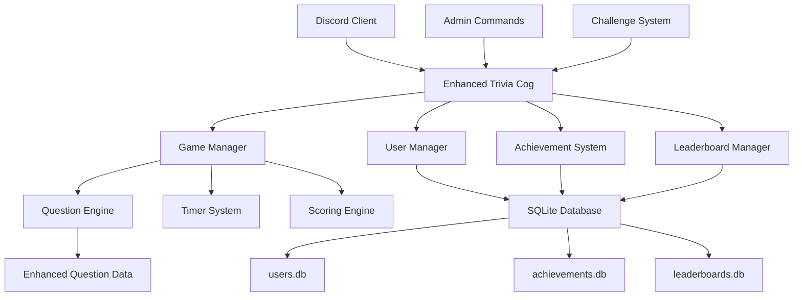
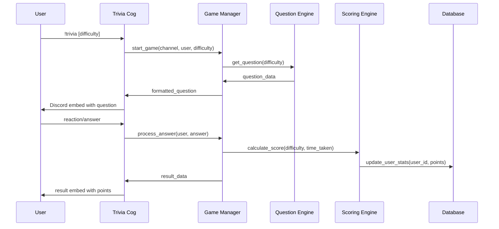

# Design Document

## Overview

The Enhanced Trivia System transforms Cozmo's basic trivia functionality into a comprehensive gaming experience with persistent scoring, achievements, multiple game modes, and competitive elements. The system uses SQLite for data persistence, implements a robust scoring algorithm, and provides multiple question types with timed gameplay. The architecture maintains the existing Cog-based structure while adding new data models and game mechanics.

## Architecture

### High-Level Architecture



### Data Flow Architecture



## Components and Interfaces

### Enhanced Trivia Cog (`cogs/enhanced_trivia.py`)

**Purpose**: Main interface for all trivia functionality with enhanced features

**Key Responsibilities**:

- Command handling for all trivia-related commands
- Game state management across multiple channels
- Integration with all subsystems (scoring, achievements, leaderboards)
- Admin command processing

**Interface**:

```python
class EnhancedTriviaCog(commands.Cog):
    # Game Commands
    async def trivia(self, ctx, difficulty: str = None)
    async def triviastats(self, ctx, user: discord.Member = None)
    async def leaderboard(self, ctx, period: str = "all")
    async def myrank(self, ctx)
    async def achievements(self, ctx, user: discord.Member = None)
    async def dailychallenge(self, ctx)
    async def triviareport(self, ctx)

    # Admin Commands
    async def triviaconfig(self, ctx, setting: str = None, value: str = None)
    async def resetstats(self, ctx, user: discord.Member)
    async def addquestion(self, ctx)

    # Event Handlers
    async def on_reaction_add(self, reaction, user)
    async def on_message(self, message)  # For fill-in-the-blank answers
```

### Game Manager (`utils/game_manager.py`)

**Purpose**: Core game logic and state management

**Key Responsibilities**:

- Active game tracking per channel
- Question lifecycle management
- Timer implementation
- Answer validation and processing

**Interface**:

```python
class GameManager:
    async def start_game(self, channel_id: int, user_id: int, difficulty: str = None) -> GameSession
    async def process_answer(self, channel_id: int, user_id: int, answer: Any) -> AnswerResult
    async def end_game(self, channel_id: int, reason: str = "completed") -> None
    async def get_active_game(self, channel_id: int) -> Optional[GameSession]
    async def cleanup_expired_games(self) -> None
```

**Data Models**:

```python
@dataclass
class GameSession:
    channel_id: int
    question_id: int
    question_type: str
    difficulty: str
    start_time: datetime
    timeout_duration: int
    participants: Set[int]
    correct_answer: Any
    is_challenge: bool = False

@dataclass
class AnswerResult:
    is_correct: bool
    points_earned: int
    time_taken: float
    achievement_unlocked: Optional[str] = None
```

### Question Engine (`utils/question_engine.py`)

**Purpose**: Question selection, formatting, and management

**Key Responsibilities**:

- Question selection based on difficulty and type
- Question formatting for different types (multiple choice, true/false, fill-in-blank)
- Custom question management
- Question statistics tracking

**Interface**:

```python
class QuestionEngine:
    async def get_question(self, difficulty: str = None, question_type: str = None) -> Question
    async def get_daily_challenge_question(self) -> Question
    async def get_weekly_challenge_questions(self) -> List[Question]
    async def add_custom_question(self, question_data: dict) -> bool
    async def validate_answer(self, question: Question, user_answer: Any) -> bool
```

**Enhanced Question Model**:

```python
@dataclass
class Question:
    id: int
    question_text: str
    question_type: str  # "multiple_choice", "true_false", "fill_blank"
    difficulty: str     # "easy", "medium", "hard"
    category: str       # "history", "players", "matches", "general"
    correct_answer: Any
    options: Optional[List[str]] = None  # For multiple choice
    answer_variations: Optional[List[str]] = None  # For fill-in-blank
    explanation: Optional[str] = None
    point_value: int = 0
    times_asked: int = 0
    times_correct: int = 0
```

### User Manager (`utils/user_manager.py`)

**Purpose**: User profile and statistics management

**Key Responsibilities**:

- User profile creation and updates
- Statistics tracking and calculation
- Streak management
- Performance analytics

**Interface**:

```python
class UserManager:
    async def get_or_create_user(self, user_id: int) -> UserProfile
    async def update_stats(self, user_id: int, points: int, is_correct: bool, difficulty: str) -> None
    async def get_user_stats(self, user_id: int) -> UserStats
    async def update_streak(self, user_id: int, is_correct: bool) -> int
    async def get_user_rank(self, user_id: int) -> int
    async def reset_user_stats(self, user_id: int) -> None
```

**Data Models**:

```python
@dataclass
class UserProfile:
    user_id: int
    total_points: int
    questions_answered: int
    questions_correct: int
    current_streak: int
    best_streak: int
    last_played: datetime
    daily_challenge_completed: Optional[date]
    weekly_challenge_completed: Optional[date]
    preferred_difficulty: Optional[str]

@dataclass
class UserStats:
    accuracy_percentage: float
    points_per_category: Dict[str, int]
    difficulty_breakdown: Dict[str, Dict[str, int]]
    recent_performance: List[bool]  # Last 10 answers
    achievements_count: int
```

### Achievement System (`utils/achievement_system.py`)

**Purpose**: Achievement tracking and reward management

**Key Responsibilities**:

- Achievement definition and tracking
- Progress monitoring
- Reward calculation
- Achievement notifications

**Interface**:

```python
class AchievementSystem:
    async def check_achievements(self, user_id: int, context: dict) -> List[Achievement]
    async def unlock_achievement(self, user_id: int, achievement_id: str) -> bool
    async def get_user_achievements(self, user_id: int) -> List[UserAchievement]
    async def get_achievement_progress(self, user_id: int, achievement_id: str) -> float
```

**Achievement Types**:

```python
ACHIEVEMENTS = {
    "hot_streak": {
        "name": "Hot Streak",
        "description": "Answer 5 questions correctly in a row",
        "requirement": {"type": "streak", "value": 5},
        "reward_points": 50,
        "emoji": "🔥"
    },
    "galaxy_expert": {
        "name": "Galaxy Expert",
        "description": "Answer 10 questions correctly in a row",
        "requirement": {"type": "streak", "value": 10},
        "reward_points": 100,
        "emoji": "⭐"
    },
    "dedicated_fan": {
        "name": "Dedicated Fan",
        "description": "Play trivia for 7 consecutive days",
        "requirement": {"type": "daily_streak", "value": 7},
        "reward_points": 200,
        "emoji": "💙"
    }
}
```

### Leaderboard Manager (`utils/leaderboard_manager.py`)

**Purpose**: Ranking and competitive features

**Key Responsibilities**:

- Leaderboard calculation and caching
- Weekly/monthly ranking resets
- Rank change tracking
- Performance comparisons

**Interface**:

```python
class LeaderboardManager:
    async def get_leaderboard(self, period: str = "all", limit: int = 10) -> List[LeaderboardEntry]
    async def get_user_rank(self, user_id: int, period: str = "all") -> int
    async def reset_weekly_rankings(self) -> None
    async def update_user_ranking(self, user_id: int, points: int) -> None
```

### Database Schema

**Users Table**:

```sql
CREATE TABLE users (
    user_id INTEGER PRIMARY KEY,
    total_points INTEGER DEFAULT 0,
    questions_answered INTEGER DEFAULT 0,
    questions_correct INTEGER DEFAULT 0,
    current_streak INTEGER DEFAULT 0,
    best_streak INTEGER DEFAULT 0,
    last_played TIMESTAMP,
    daily_challenge_completed DATE,
    weekly_challenge_completed DATE,
    preferred_difficulty TEXT,
    created_at TIMESTAMP DEFAULT CURRENT_TIMESTAMP
);
```

**Achievements Table**:

```sql
CREATE TABLE user_achievements (
    id INTEGER PRIMARY KEY AUTOINCREMENT,
    user_id INTEGER,
    achievement_id TEXT,
    unlocked_at TIMESTAMP DEFAULT CURRENT_TIMESTAMP,
    FOREIGN KEY (user_id) REFERENCES users (user_id),
    UNIQUE(user_id, achievement_id)
);
```

**Questions Table**:

```sql
CREATE TABLE questions (
    id INTEGER PRIMARY KEY AUTOINCREMENT,
    question_text TEXT NOT NULL,
    question_type TEXT NOT NULL,
    difficulty TEXT NOT NULL,
    category TEXT NOT NULL,
    correct_answer TEXT NOT NULL,
    options TEXT, -- JSON for multiple choice options
    answer_variations TEXT, -- JSON for fill-in-blank variations
    explanation TEXT,
    point_value INTEGER,
    times_asked INTEGER DEFAULT 0,
    times_correct INTEGER DEFAULT 0,
    created_at TIMESTAMP DEFAULT CURRENT_TIMESTAMP
);
```

**Weekly Rankings Table**:

```sql
CREATE TABLE weekly_rankings (
    id INTEGER PRIMARY KEY AUTOINCREMENT,
    user_id INTEGER,
    week_start DATE,
    points INTEGER DEFAULT 0,
    rank INTEGER,
    FOREIGN KEY (user_id) REFERENCES users (user_id)
);
```

## Error Handling

### Database Error Handling

1. **Connection Failures**: Implement connection pooling and retry logic
2. **Data Corruption**: Regular database integrity checks and backups
3. **Concurrent Access**: Use proper locking mechanisms for critical operations
4. **Migration Errors**: Implement database schema versioning

### Game State Error Handling

1. **Timer Failures**: Graceful timeout handling with user notifications
2. **Concurrent Games**: Proper isolation between channel-specific games
3. **User Disconnection**: Cleanup mechanisms for abandoned games
4. **Invalid Answers**: Robust input validation and sanitization

### Discord Integration Error Handling

1. **Permission Issues**: Check permissions before attempting reactions/messages
2. **Rate Limiting**: Implement proper rate limiting and queue management
3. **Message Deletion**: Handle cases where game messages are deleted
4. **Channel Access**: Validate channel accessibility before operations

## Testing Strategy

### Unit Testing

1. **Question Engine**: Test question selection, validation, and formatting
2. **Scoring System**: Validate point calculations and streak logic
3. **Achievement System**: Test achievement triggers and progress tracking
4. **Database Operations**: Mock database operations and test data integrity

### Integration Testing

1. **Game Flow**: End-to-end testing of complete trivia games
2. **Multi-Channel**: Test concurrent games in different channels
3. **Achievement Integration**: Test achievement unlocking during gameplay
4. **Leaderboard Updates**: Validate ranking calculations and updates

### Performance Testing

1. **Database Performance**: Test with large datasets and concurrent users
2. **Memory Usage**: Monitor memory usage during extended gameplay sessions
3. **Response Times**: Ensure quick response times for all commands
4. **Concurrent Load**: Test system behavior with multiple simultaneous games

## Security Considerations

1. **Input Validation**: Sanitize all user inputs, especially for custom questions
2. **SQL Injection Prevention**: Use parameterized queries for all database operations
3. **Rate Limiting**: Prevent spam and abuse of trivia commands
4. **Data Privacy**: Ensure user data is handled according to Discord's guidelines
5. **Admin Permissions**: Validate administrator permissions for sensitive commands

## Performance Optimizations

1. **Database Indexing**: Create appropriate indexes for frequently queried columns
2. **Caching**: Implement caching for leaderboards and frequently accessed data
3. **Async Operations**: Ensure all I/O operations are properly asynchronous
4. **Memory Management**: Efficient cleanup of completed games and expired data
5. **Query Optimization**: Optimize database queries for better performance
